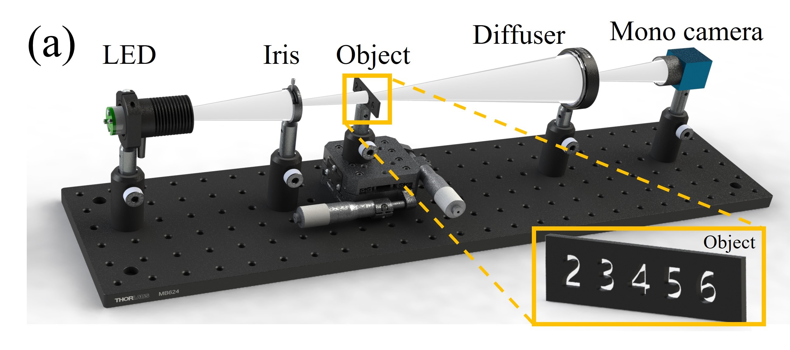
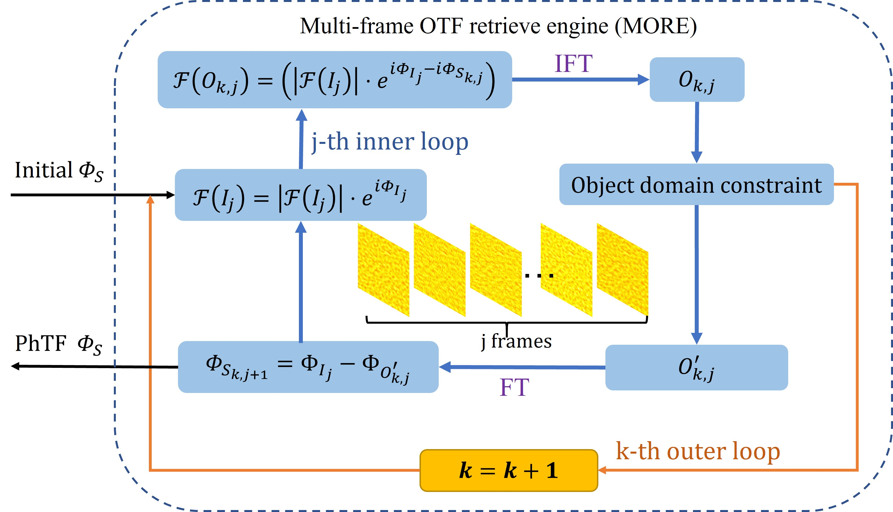
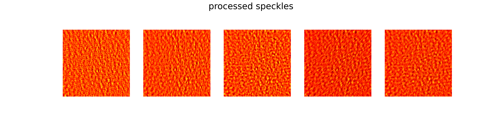
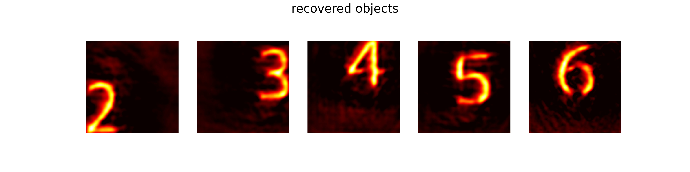

# Python Implementation of Multi-frame OTF Retrieval Engine (MORE) algorithm

MORE is an algorithm, which can reconstruction scattered objects with better quality. It has been proved that it works well under broadband illumination and underexposure scenes.

## Experiment

<b>Non-invasive imaging through scatter medium within memory effect</b>

## Algorithm

Different from single-frame phase recovery algorithms such as HIO and ER, MORE achieves object reconstruction by <b>captured multi-frame speckle information to retrieval the optical transfer function</b> of the imaging system.

## Usage

`python main.py`

<b>Recovered digits objects "2,3,4,5,6" from their speckles</b>

## Citation

[1] Yuan, Yuan, and Hui Chen. "Dynamic noninvasive imaging through turbid media under low signal-noise-ratio." New Journal of Physics 22.9 (2020): 093046.

[2] Sun, Yunong, et al. "Non-invasive color imaging through scattering medium under broadband illumination." Optics and Lasers in Engineering 167 (2023): 107615.